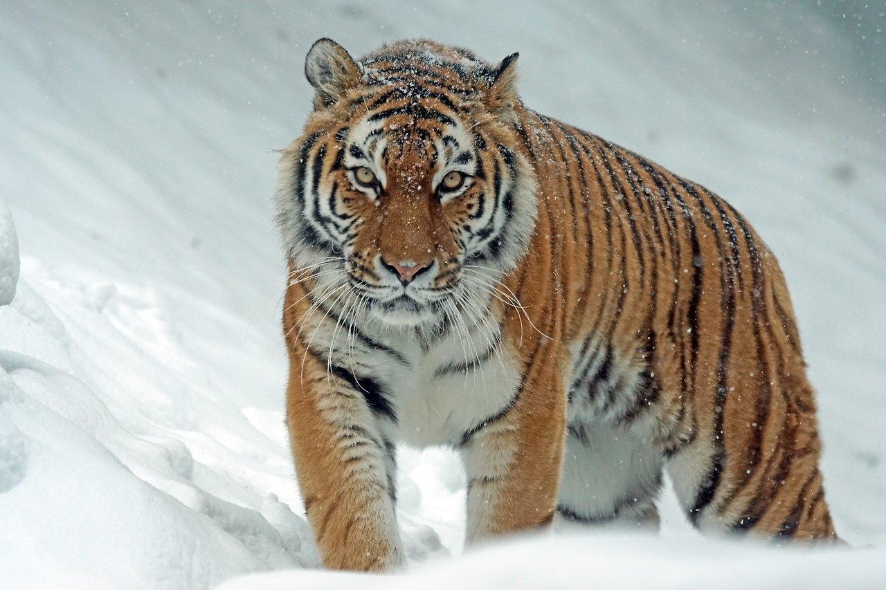
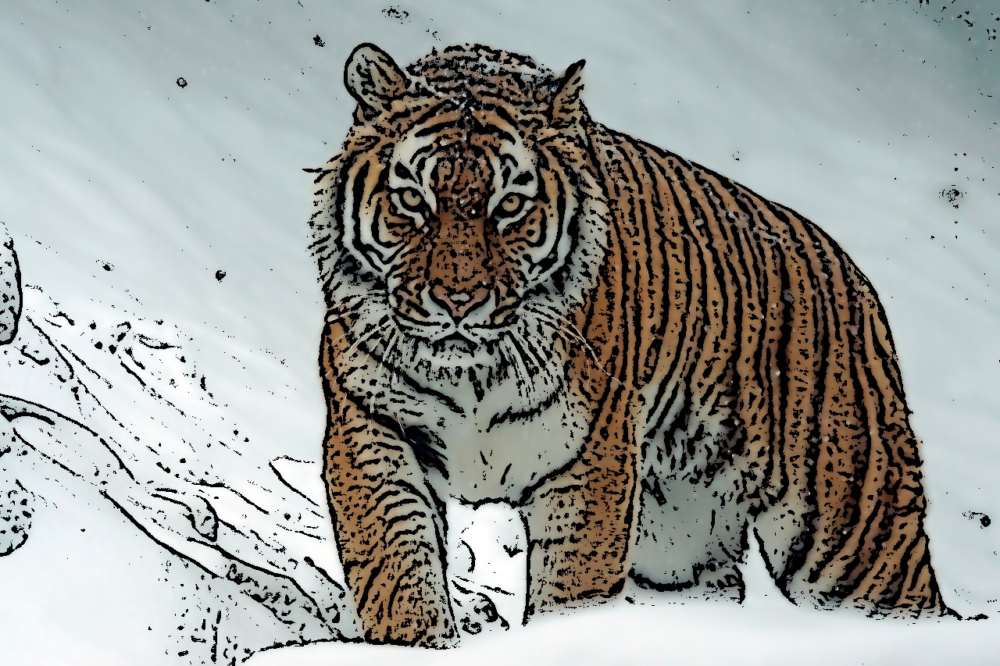
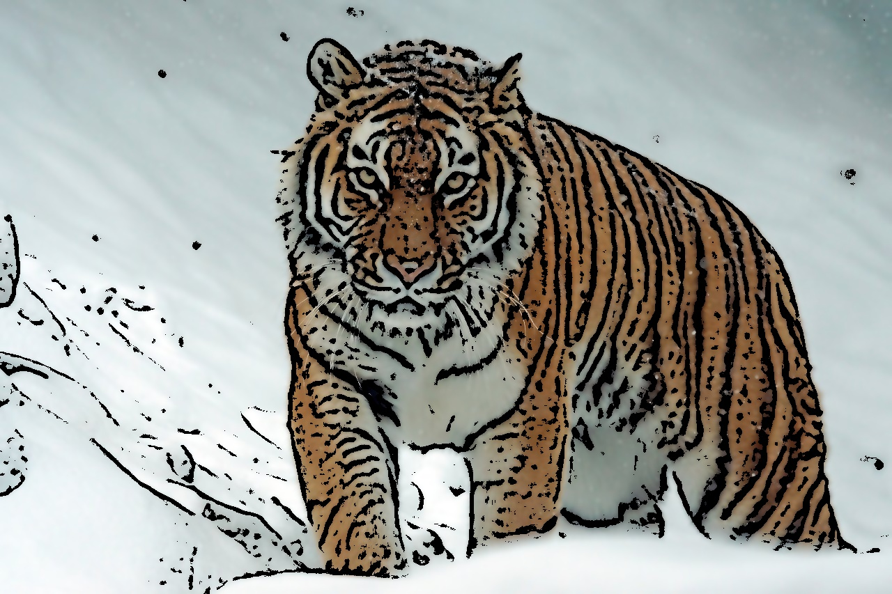
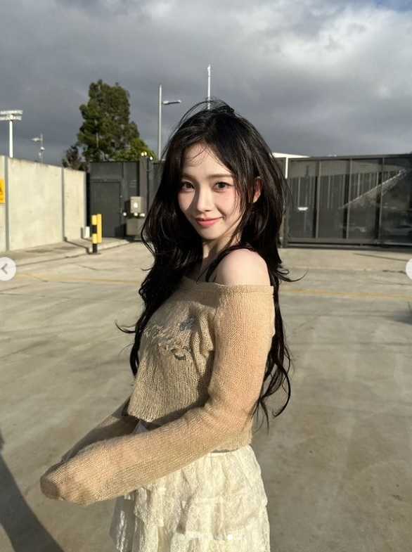
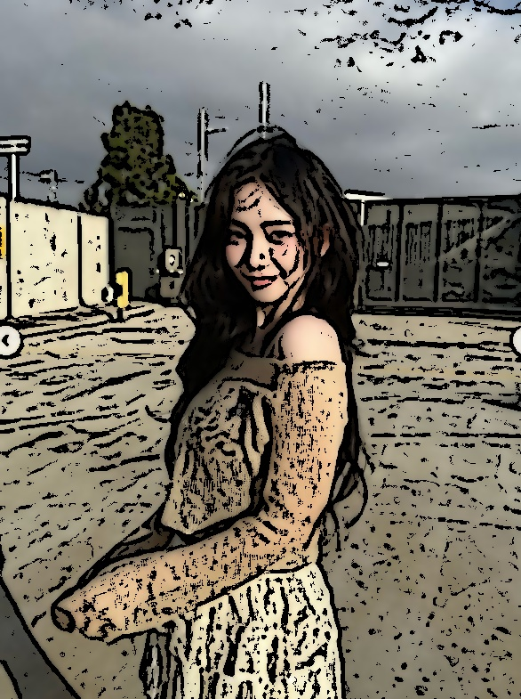
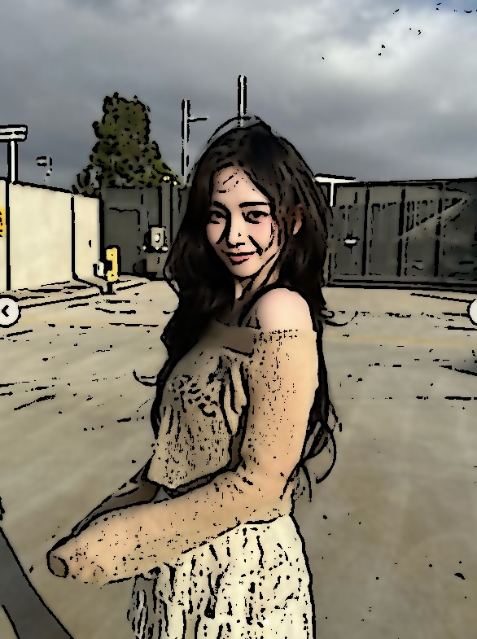

# OpenCV Cartoon Editor

## 개요
이미지를 카툰 스타일로 변환해주는 카툰 에디터입니다.

## 주요 기능
- 카툰 렌더링
- 실시간 파라미터 조절
  - C 값
  - blockSize 값
  - medianBlur 커널 크기
- 실행 중 이미지 저장
  - Enter 키를 누르면 현재 카툰 결과를 파일로 저장
  - 저장 파일명: cartoon_{img_src}
  - 저장 위치: imgs/cartoon_{img_src}

## 요구사항

```bash
pip install opencv-python opencv-contrib-python
```

## 키보드 조작
프로그램 실행 중 아래 키를 사용할 수 있습니다. (각 키와 값이 화면에 표시됨)

- `-`, `+` : C 값 1 감소/증가
- `[`, `]` : blockSize 2 감소/증가 (최소 3, 홀수 유지)
- `<`, `>` : medianBlur 커널 2 감소/증가 (최소 3, 홀수 유지)
- Enter : 현재 카툰 이미지 저장
- Q 또는 ESC : 종료

## 현재 코드의 기본 설정
- img_dir = 'imgs'
- img_src = 'tiger.jpg'
- C = 2
- blockSize = 9
- medianBlur = 7

## 실행 예시
### 1) 원본 사진 (호랑이)


- 사진: tiger.jpg
- 설명: 필터 적용 전 원본 이미지

### 2) 카툰 결과 (기본값)


- 사진: cartoon_tiger_default.jpg
- 설정값: C=2, blockSize=9, medianBlur=7
- 설명: 기본 파라미터로 렌더링한 결과

### 3) 카툰 결과 (수정값)


- 사진: cartoon_tiger_modified.jpg
- 설정값: C=3, blockSize=13, medianBlur=9
- 설명: 엣지/질감 조절 후 렌더링한 결과

### 4) 원본 사진 (카리나)


- 사진: karina.jpg
- 설명: 필터 적용 전 원본 이미지

### 5) 카툰 결과 (기본값)


- 사진: cartoon_karina_default.jpg
- 설정값: C=2, blockSize=9, medianBlur=7
- 설명: 프로그램 기본값으로 렌더링한 결과

### 6) 카툰 결과 (수정값)


- 사진: cartoon_karina_modified.jpg
- 설정값: C=6, blockSize=9, medianBlur=5
- 설명: karina_modified 설정값으로 렌더링한 결과

## 한계점